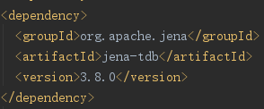

# Jena连接本体&数据

TDB是一种存储3元组的图数据库，这种存储方式比较适合知识图谱。我们现在已经有了.owl本体文件和存储3元组的.nt数据文件。现在需要将它们结合在一起并运用推理机完善数据。这里利用Jena API来实现，首先下载一个Java的IDE（如eclipse、IntelliJ），我用的IntelliJ。

### maven管理依赖包
新建一个maven项目，管理依赖包比较方便，在pom.xml中添加jena-tdb依赖：

### 代码

项目内新建一个.java文件：
<code>
<pre>
package RDFDemo;

import org.apache.jena.ontology.OntModel;
import org.apache.jena.ontology.OntModelSpec;
import org.apache.jena.query.*;
import org.apache.jena.rdf.model.ModelFactory;
import org.apache.jena.tdb.TDBFactory;
import org.apache.jena.util.FileManager;

import java.io.InputStream;

public class importNTtriplr {
    public static void main(String[] args) {
        // owl & 数据的路径
        String owlPath = "G:\\暑假-传统建筑\\protege存储\\sysu.owl";
        String dataPath = "G:\\暑假-传统建筑\\d2rq-0.8.1\\sysu_add.nt";
        // 新建一个ontmodel并设为可推理的
        OntModel ontmodel = ModelFactory.createOntologyModel(OntModelSpec.OWL_MEM_MICRO_RULE_INF, null);
        // 将.owl和.nt内的数据都读入到这个model中
        ontmodel.read(owlPath);
        InputStream in = FileManager.get().open(dataPath);
        ontmodel.read(in, "", "N3");
        // 将数据存入TDB
        String tdbPath = "DataBase\\sysu_TDB";
        // 连接TDB
        Dataset ds = TDBFactory.createDataset(tdbPath);
        ds.begin(ReadWrite.WRITE);
        // 将此model加入此TDB
        ds.addNamedModel("sysuTDB", ontmodel);
        ds.commit();
        ds.end();
        ds.close();

        // SPARQL测试
        String prefix="PREFIX rdf:<http://www.w3.org/1999/02/22-rdf-syntax-ns#>"+
                "PREFIX xsd:<http://www.w3.org/2000/10/XMLSchema#>"+
                "PREFIX owl:<http://www.w3.org/2002/07/owl#>"+
                "PREFIX rdfs:<http://www.w3.org/2000/01/rdf-schema#>"+
                "PREFIX :<http://www.sysu.com/>";
        String strq = "SELECT ?n ?xn WHERE {" +
                "?s rdf:type :学院." +
                "?s :名称 ?n." +
                "?x rdf:type :专业." +
                "?s :包含 ?x." +
                "?x :名称 ?xn." +
                "}";
        String strq2 = "SELECT ?xn WHERE {" +
                "?s rdf:type :学院." +
                "?s :名称 '化学学院'." +
                "?x rdf:type :专业." +
                "?s :包含 ?x." +
                "?x :名称 ?xn." +
                "}";
        Query query = QueryFactory.create(prefix + strq2);
        // 执行查询
        QueryExecution qe = QueryExecutionFactory.create(query, ontmodel);
        ResultSet results = qe.execSelect();
        // 输出结果
        ResultSetFormatter.out(System.out, results, query);
        // 释放资源
        qe.close();
    }
}
</pre>
</code>

.java文件和生成的sysu_TDB数据库可以在此处找到。