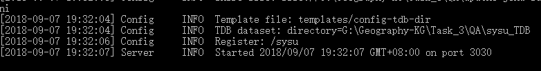

## 简单命令行QA

### 介绍

- sysu_TDB是我们要用到的TDB数据库
- apache-jena-fuseki-3.8.0是Jena提供的一个前端管理工具
- REfO_KBQA_Demo是我们的代码

### 过程

- 首先，打开cmd，跳转到apache-jena-fuseki-3.8.0目录下，我们需要用到其中的fuseki-server命令
- 在cmd内输入命令： <pre>fuseki-server --loc=G:\Geography-KG\Task\_3\QA\sysu\_TDB /sysu</pre>
	- 其中G:\Geography-KG\Task\_3\QA\sysu\_TDB是这个TDB数据库在电脑内的路径
	- /sysu是数据库导入到fuseki的命名（这里的名字要和jena\_sparql\_endpoint.py内的endpoint\_url对应），不要改，如果要改那么endpoint\_url也要相应改变
- 成功后可以看到如下截图，在浏览器内打开：http://localhost:3030/，可以看到我们成功导入了sysu数据库

- fuseki-server运行的cmd不要关闭，否则服务会断开。我们打开一个新的cmd，跳转到REfO\_KBQA\_Demo目录下，命令行运行（这里用的是python2）：
<pre>python query_main.py</pre>

- 现在可以输入关于中大校园/校区/学院/专业的问题
- 例如：
<pre>
广州校区包含哪些校园
广州校区有哪些学院
东校园有哪些学院
法学院有哪些专业
社会学与人类学学院有什么专业
人类学系属于哪个学院
软件工程专业是哪个学院的
软件工程在哪个校区
南校园有多大
东校园在哪
格致园位于何处
明德园-1号楼的地址
格致园位于哪个校园
珠海校园的面积
东校园有多少个专业
广州校区有几个校园
广州校区包括几个学院
</pre>