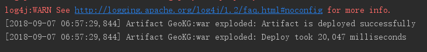
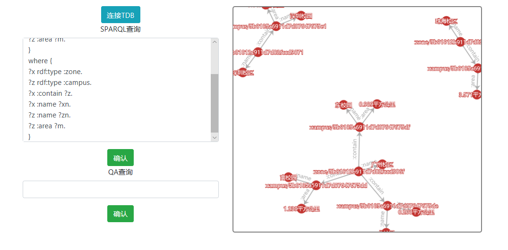

### 项目介绍

GeoKG是一个完整的Maven Java Web项目，用eclipse或IntelliJ IDEA打开即可

#### 运行介绍

用IntelliJ IDEA打开，配置一下tomcat，然后用tomcat运行，等待运行成功（下方可以看到后台输出）：

在浏览器内输入地址 http://localhost:8080/GeoKG

点击Echarts进入查询页面，前端目前只完成了SPARQL查询

在左边SPARQL查询框内输入SPARQL查询语句，可以在右侧看到结果：

右侧结果可以拖动，放大，缩小（用户体验不是很好以后会改的）

这里给2个SPARQL查询的例子：

- 查询各个校区都包含哪些校园；各个校区的名字；各个校园的名字和占地面积
<pre>
construct {
?x :contain ?z.
?x :name ?xn.
?z :name ?zn.
?z :area ?m.
}
where {
?x rdf:type :zone.
?z rdf:type :campus.
?x :contain ?z.
?x :name ?xn.
?z :name ?zn.
?z :area ?m.
}
</pre>

- 查询各个校区都包含了哪些校园，显示它们的名字
<pre>
select ?sn ?xn where {
?s rdf:type :zone.
?x rdf:type :campus.
?s :contain ?x.
?s :name ?sn.
?x :name ?xn.
}
</pre>