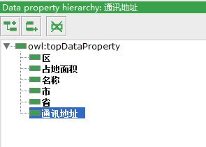

# protege构建本体

## 下载 & 教程
protege是一个开源的本体构建工具，可以用于构建知识图谱的本体概念。[官网](https://protege.stanford.edu/)下载protege，我用的是protege-5.2.0版。将zip文件解压缩，双击run.bat或者Protege.exe运行，第一次运行最好用run.bat。

[4.X版的教程](http://mowl-power.cs.man.ac.uk/protegeowltutorial/resources/ProtegeOWLTutorialP4_v1_3.pdf)（较全）

[5.X版的教程](https://media.readthedocs.org/pdf/go-protege-tutorial/latest/go-protege-tutorial.pdf)（不太全面，且需翻墙）

[使用简介](http://cgi.csc.liv.ac.uk/~frank/teaching/comp08/protege_tutorial.pdf)

## 本体构建
以中山大学的的校区院系划分为例构建一个本体。在**Active Ontology** 窗口内，自定义合适的Ontology IRI。窗口的显示在Window -> Tabs中可选。

在右侧还设置了一些限制，例如校园、校区、学院、建筑这些概念类都是互斥的，校园包含some学院等等。

### 概念类
首先，中大有3校区5校园，各个校园都包含若干学院，学院下又包含1个或多个专业。在**Classes**窗口，通过点击下面3个按钮可以：新建此概念类的子类、新建此概念类的兄弟类、删除此概念类：

### 数据属性
一个概念类的数据属性是指属性值为字面量，而不是其他概念类。例如校园这个概念类，有名称、占地面积、通讯地址等数据属性；而楼这个概念类，有省、市、区、通讯地址、名称等属性：

属性也可以有子属性，这里我没有涉及，还可以在右侧限制这些属性的**domain**和**range**。

### 对象属性
对象属性的特别之处在于，这个属性的值不是字面量，而是一个实体。例如：A->的儿子是->B，其中A和B都是人的实例，"的儿子是"是一个对象属性。在我们的例子中，只涉及到2个对象属性：包含、属于，并且这两个属性互为逆关系，在右侧设置**inverse of**来定义。并且包含和属于这2个属性都是可传递的：A包含B，B包含C，则有A包含C。所以可以在中间窗口处将**transitive**勾选。

### 推理机
推理机可以用来帮助我们完善本体，也可以用来检验本体是否是连贯一致的。 在Reasoner选择一个推理机（例如HermiT）,然后Reasoner->Start reasoner开启推理。在整个页面的右下角小字处可以看到推理机当前状态。也可以在Tools->Debug Ontology来测试本体的连贯一致性。

### 保存
可以将我们构建的本体保存为各种格式，一般选RDF/XML，最后生成一个[sysu.owl](https://github.com/samayuki/Knowledge-Graph-Learning/tree/master/myData/protege构建本体)文件。
