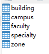
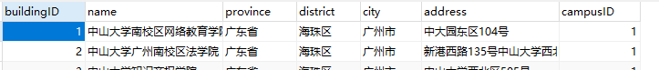
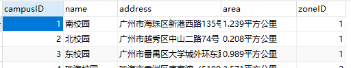
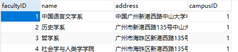
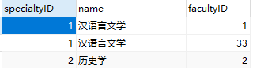
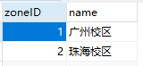
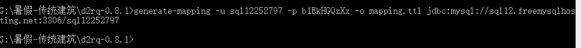
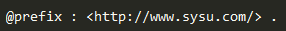

# 关系数据库转RDF

在知识图谱中数据以3元组的形式存储，但是我们利用爬虫爬取下来的数据更适合存储在关系型数据库（如MySQL）中，所以需要将数据从关系数据库转到RDF。这里我利用的是D2RQ，这是一个很有用的工具，需要自己写mapping关系，将关系型数据库与owl文件中的概念进行映射。

## 安装D2RQ
[官网](http://d2rq.org/)下载，我下载的是d2rq-0.8.1.zip,下载后解压缩即可。

## 配置
要下载数据库对应的JDBC驱动文件(.jar)，将其放在d2rq-0.8.1/lib/db-drivers文件夹中，D2RQ自带了MySQL和PostgreSQL的驱动文件，但是也可能与你电脑上的数据库版本有冲突，如果发现有冲突，就多换几个其他版本的.jar文件试试。

我用的关系型数据库是MySQL 8，需要将MySQL的JDBC驱动文件换成5.1.47版才能运行。

## 我的数据格式

用的是阿里云上的MySQL，一共有5个表，依次代表：楼、校园、学院、专业、校区：

表的内部结构如下：

- building表：

- campus表：

- faculty表：

- specially表：

- zone表：

## 开始转换

#### 生成默认的mapping文件

管理员身份运行cmd，跳到d2rq-0.8.1文件夹目录处。然后使用generate-mapping命令（参数设置可以在D2RQ官方文档中查看）：

这时可以在d2rq-0.8.1文件夹内看到刚刚生成的mapping.ttl文件。

#### 修改mapping文件
用sublime或记事本打开编辑，修改一下，将各表的数据与owl文件内的概念映射起来。改的地方不多，首先添加一个前缀缩写，这个IRI与我们在owl文件中设置的Ontology IRI相同，待会各概念的写法就可以比较简洁了：

mapping规则可以参考D2RQ官方文档，修改后的ttl文件可在此处找到。

#### 转换
使用dump-rdf命令，将数据转换为三元组格式并存储起来（默认存储为N-Triple格式）：

成功后可以看到d2rq-0.8.1文件夹内生成了sysu_add.nt文件，使用sublime或记事本打开可以看到许多三元组（如果有中文可能无法正常显示，不过这不影响）。